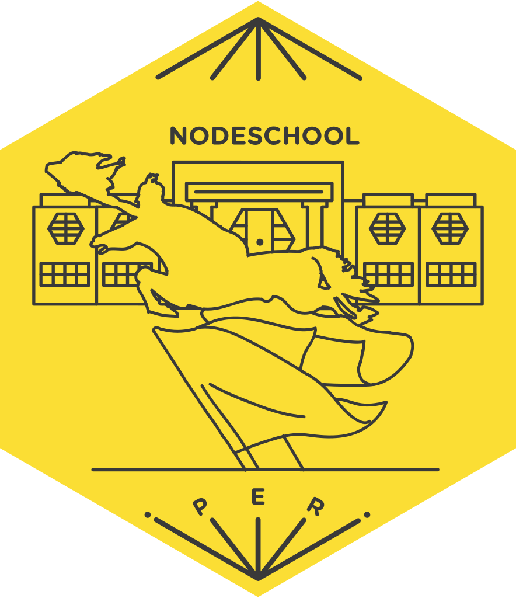

# NodeSchool Pereira

  

Bienvenidos a NodeSchool una comunidad mundial enfocada en capacitar sobre Node.js y JavaScript en general. Este es el repositorio para el capitulo Pereira.

Este capitulo es organizado por [PereiraJS](https.//pereirajs.org), [pereirajscode@gmail.com](pereirajscode@gmail.com)

La idea es que en este repositorio puedas [hacer alguna pregunta](https://github.com/nodeschool/pereira/issues/new) sobre el evento o el contenido de los talleres o si no tienes idea que paso seguir en los talleres, no tengas miedo y [PREGUNTA!](https://github.com/nodeschool/pereira/issues/new)

## Próximos Eventos

* 23 de Junio 2018

## Eventos Pasados

* 5 de Noviembre, NodeSchool for Girls (Bajo la coordinacion de jointDeveloper)
* 21 de Mayo 2016, NodeSchool International Day
* 23 de Mayo 2015, NodeSchool International Day

## Más Información
 * Sitio oficial del evento en Pereira: [nodeschool.io/periera](http://nodeschool.io/pereira)
 * Sitio oficial de la comunida NodeSchool: [nodeschool.io](http://nodeschool.io)
 * Sitio oficial del evento mundial: [nodeschool.io/international-day](http://nodeschool.io/international-day/)
 * Sitio oficial de la comunidad PereiraJS: [pereirajs.org](https://pereirajs.org)

___

## Sobre la web

### Base

* https://onepagelove.com/meetup
